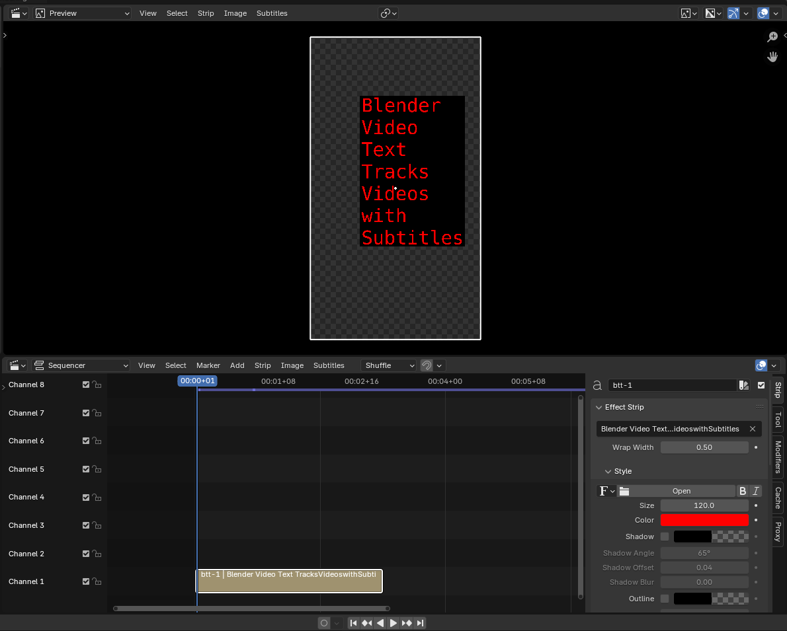

[Home](/btt/) |
[Download](/btt/download) |
[Converter](/btt/converter) |
[Support](https://github.com/moixllik/btt/issues)

---



## BTT File

For example: [./subtitles.btt](./subtitles.btt)

```s
@channel=1;
@font_size=120.0;
@color=#ff0000ff;
@use_box=1;
@box_color=#000000ff;

file=./subtitles.btt;
start=00:00:00+0;
end=00:00:03+0;
location=0.3 0.3;
align_x=left;
align_y=bottom;
wrap_width=0.5;
Blender Video Text Tracks
Videos
with
Subtitles
```